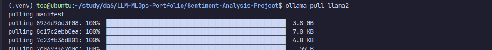
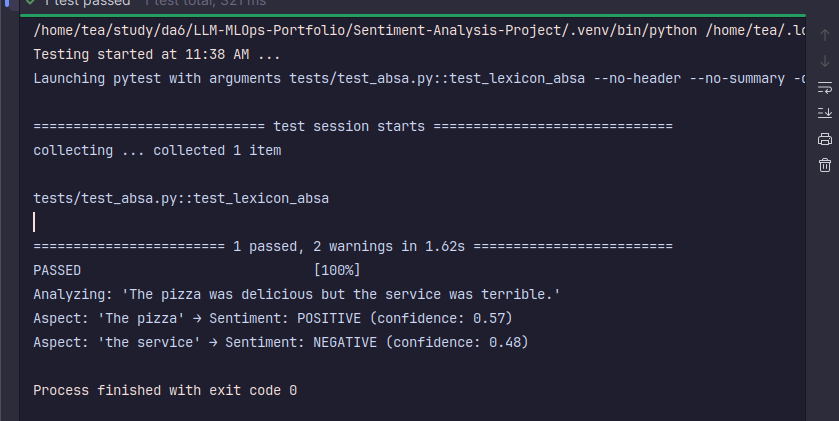
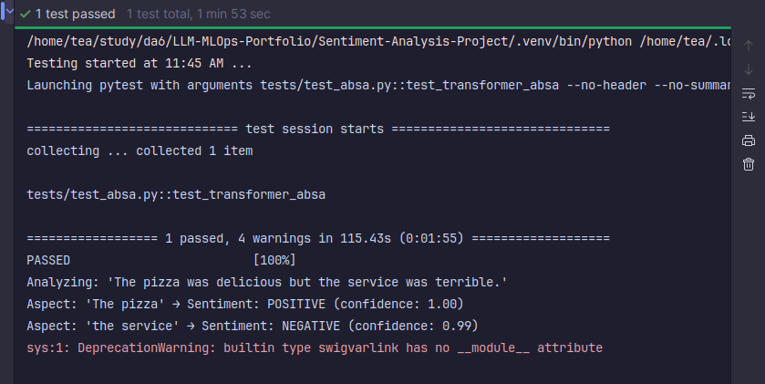

# Aspect-Based Sentiment Analysis Project

### **Group**: Group number 2

### **Team Members**: Tran Huong Tra , Geetika Sethi

---
## Table of Contents
- [Overview](#overview)
- [Project Structure](#project-structure)
- [Setup and Installation](#setup-and-installation)
- [Implementations](#implementations)
- [API Documentation](#api-documentation)
- [Design Decisions](#design-decisions)
---
## Overview

This project implements and compares three approaches for Aspect-Based Sentiment Analysis (ABSA) on review data:

- **Lexicon-based ABSA:** Rule-based aspect and sentiment extraction using spaCy and VADER.
- **Transformer-based ABSA:** Leverages pre-trained Hugging Face transformer models for joint aspect and sentiment extraction.
- **LLM-based ABSA:** Uses a local Large Language Model (via Ollama) for zero-shot ABSA through prompt engineering.

The system is tested on **70 real-world review samples** and includes a reproducible comparison notebook.

---

## Project Structure

```
sentiment-analysis-project/
├── README.md/
├── requirements.txt/
├── notebooks/
│   └── comparision.ipynb
├── tests/
│   └── test_lexicon.py
│   └── test_llm.py/
│   └── test_transformer.py/
├── src/
│   └── base.py
│   └── lexicon_Absa.py
│   └── llm_absa.py
│   └── transformer_absa.py
├── data/
    └── test_samples.json
```
---


## Setup and Installation 

1. Clone the repository and install dependencies:
```
pip install -r requirements.txt
```


2. Install additional NLP resources:
```
python -m spacy download en_core_web_sm
```

3. Install and start Ollama:
```
ollama pull llama2
```



---

## Implementations

#### Test Implementation 1 - Lexicon-Based with spaCy



#### Test Implementation 2 - Pre-trained Model



#### Test Implementation 3 - LLM with Ollama


---

## API Documentation

All models implement the same interface (inherited from ABSAAnalyzer):
```
def analyze(self, text: str) -> List[AspectSentiment]:

    Analyze input text and return a list of aspect-sentiment pairs.

    Args:
        text (str): The input review or sentence.

    Returns:
        List[AspectSentiment]: A list of results, one per extracted aspect.
```

---

## Design Decisions
- **Unified API**: All ABSA implementations inherit from a common abstract base class (ABSAAnalyzer). This ensures all models expose the same analyze(text) method and return results in the same format, making downstream comparison and integration simple and robust. 


- **Dataset Selection**: Real-world restaurant review sentences were selected to ensure the models are tested on both typical and challenging cases, including simple, multi-aspect, and edge (sarcasm, implicit sentiment) examples.
